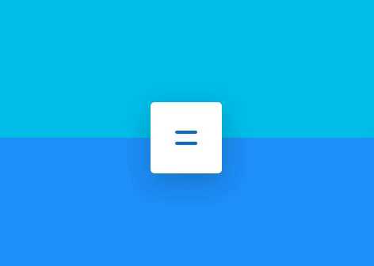
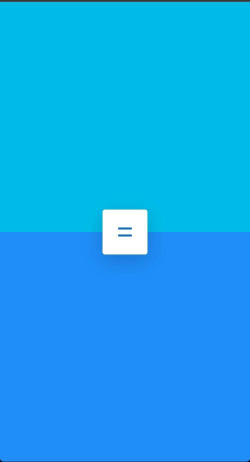

# Animation-menu

### Desktop

  

### Mobile

  

## 📢 Visite o site

[Beautysalon](https://robotsdeveloper.github.io/Beautysalon/).

## 🧠 Tecnologias

Esse projeto foi desenvolvido com as seguintes tecnologias:

-   HTML
-   CSS
-   Sass

(<a href="#top">back to top</a>)

## 💻 Projeto

Menu com animações interativas.

(<a href="#top">back to top</a>)

---

Feito com ♥ by Robotdeveloper 🤖
